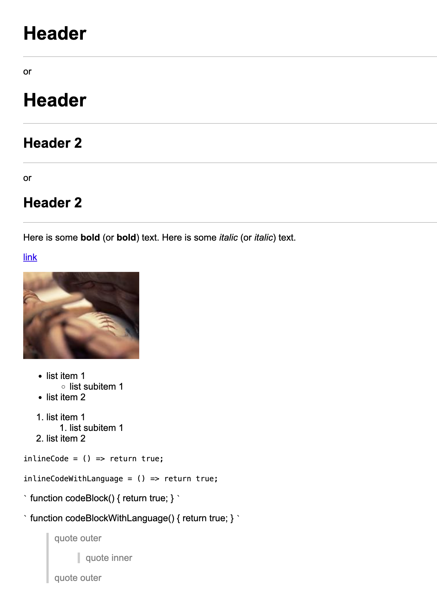

# Markdown Compiler

A Markdown-to-HTML compiler written in C#. This project demonstrates core concepts of compiler construction, including lexical analysis, parsing, syntax transformation, and code generation.

## How It Works

The compiler follows a classic pipeline:

1. Lexer (Tokenizer): Scans the raw Markdown input and produces a list of tokens.
2. Parser: Processes tokens into an abstract syntax tree (AST) representing the document structure.
3. Code Generator: Converts the AST into the target language (HTML).

## Example



## Supported Syntax

- Headers (`#`, `##`, etc.)
- Bold / Italic text
- Ordered and Unordered Lists
- Code Blocks
- Inline Code
- Blockquotes
- Horizontal Rules
- Links & Images

A full example of compiled output can be found in `Compiler.Tests/testdata/example.html`.

## Usage

```csharp
string html = new Compiler().Compile("# Hello world");
Console.WriteLine(html); // <h1>Hello world</h1>
```

## Testing

```bash
./test.sh
```

_(If needed: `chmod +x test.sh` to make the script executable.)_

## Tech

**C#**, **.NET**, **xUnit**

## License

MIT
